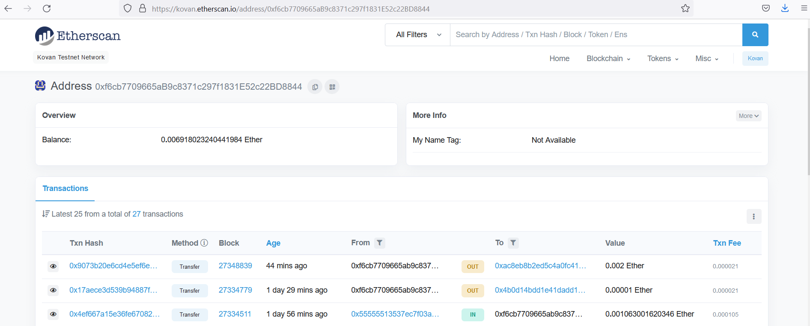
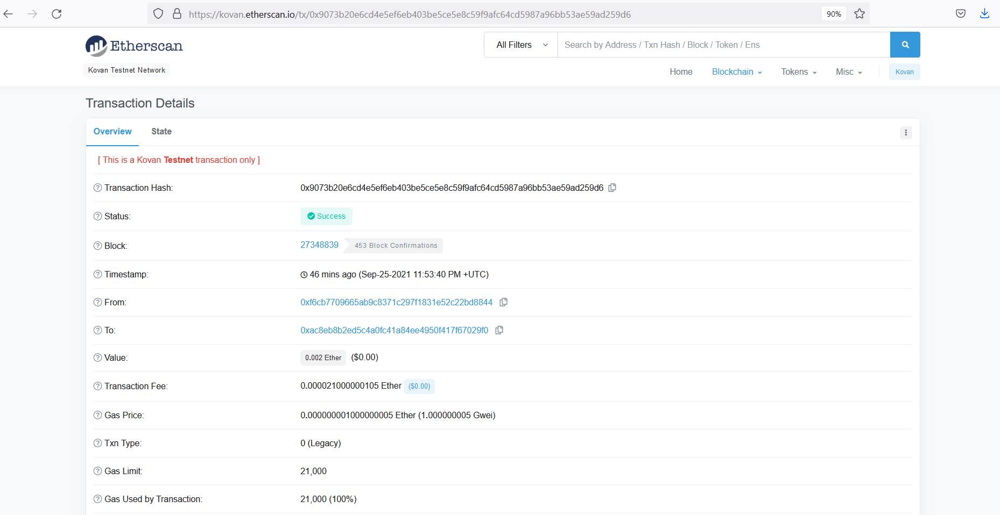
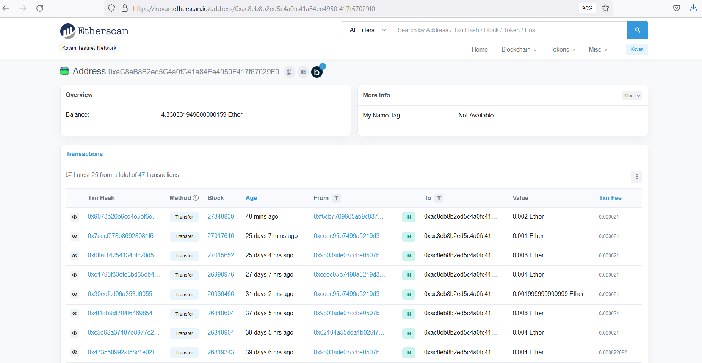

# Blockchain2

This application enables you to find and pay for fintech candidates using Ethereum.

## Dependencies

The following Python libraries are required:  
streamlit (pip install streamlit==0.84.2)\
bip44 (pip install bip44)\
web3 (pip install web3==5.17)

An Infura account is also required (https://infura.io) \
The following environment variables should be setup within the .env file:\
MNEMONIC - The mnemonic seed for the account\
WEB3_INFURA_PROJECT_ID - The Infura project ID

## Sample Transaction Screenshots

Screenshot showing sender account details:

Screenshot showing transaction details:

Screenshot showing recipient account details:

